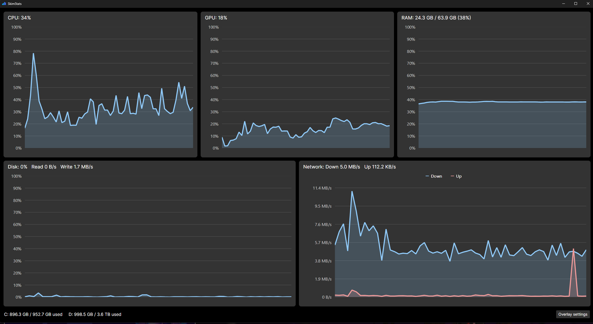

<p align="center">
  
</p>

<h1 align="center">SkimStats</h1>

<p align="center">
  A lightweight Windows system monitor with a click-through overlay for games.<br>
  Part of the <a href="https://skimmilkexe.dev/software">SkimMilk.EXE</a> app family.
</p>

<p align="center">
  
</p>

## Features

- **Live graphs** of CPU, RAM, GPU, disk and network usage in the main window
- **Game overlay**: a transparent, always-on-top, click-through window that shows the stats you pick, with optional mini graphs
- **FPS, 1% low and frame time** for the game in front, measured with Intel PresentMon
- **GPU and CPU temperatures**
- **Shows up only when you need it**: always, whenever a fullscreen app is in front, or only for the games you list
- **Customizable**: pick the stats, corner or drag-to-place position, monitor, size, font, color and background opacity
- **Global hotkey** (`Ctrl+Shift+O` by default) and a tray icon
- Starts minimized and can launch with Windows
- **Light on resources**: the overlay uses well under 1% CPU

| Main window | Settings |
|---|---|
|  |  |

## Install

Download `SkimStats.exe` from the [latest release](https://github.com/SkimMilkEXE/SkimStats/releases/latest), put it anywhere and run it.

Needs Windows 10 or 11 (64-bit). Nothing else to install, because .NET is bundled into the exe. Settings are saved in `%AppData%\SkimStats`, and the PresentMon helper used for FPS is copied to `%LocalAppData%\SkimStats` the first time FPS is turned on.

Windows SmartScreen may warn you because the exe isn't code-signed. Click **More info → Run anyway**.

## Is it safe with anti-cheat?

The overlay is a normal window that sits on top of the game. SkimStats doesn't inject DLLs, hook DirectX or Vulkan, or touch the game's memory. FPS comes from frame events that Windows already logs (ETW), read by Intel's PresentMon.

The one exception is the optional **CPU temperature** (see below). It uses a kernel driver, and some anti-cheats don't like that. It's off by default.

## Notes and limits

- **Exclusive fullscreen.** The overlay works over borderless/windowed games and most "fullscreen" games on Windows 10/11, because Windows runs them with fullscreen optimizations. A game in true exclusive fullscreen draws over everything, the overlay included. Switch it to borderless if that happens.
- **FPS needs a one-time permission.** Windows only lets admins and members of the *Performance Log Users* group read frame timings. Turn on FPS in settings and click **Allow FPS tracking**. That adds your account to the group after one admin prompt. Sign out of Windows and back in for it to take effect.
- **CPU temperature needs admin and the PawnIO driver.** Reading the CPU sensor needs the free [PawnIO](https://pawnio.eu/) driver installed and SkimStats running as admin. Settings has buttons for both. GPU temperature needs neither: it comes from the same source Task Manager uses.
- **Windows only** for now. A Linux build may come later.

## Build from source

Needs the [.NET 10 SDK](https://dotnet.microsoft.com/download/dotnet/10.0).

```powershell
dotnet run --project src/SkimStats   # run
dotnet test                          # run the tests
.\publish.ps1                        # build the release exe into artifacts/
```

### Tech

- C# / .NET 10 with [Avalonia UI](https://avaloniaui.net/), using MVVM via CommunityToolkit.Mvvm
- [LiveCharts2](https://livecharts.dev/) for the main window graphs, and a small custom-drawn sparkline for the overlay
- Win32 interop for click-through windows, global hotkeys and foreground-app detection
- Performance counters, `GlobalMemoryStatusEx`, network interface stats and D3DKMT (GPU temperature)
- [PresentMon](https://github.com/GameTechDev/PresentMon) for FPS and [LibreHardwareMonitor](https://github.com/LibreHardwareMonitor/LibreHardwareMonitor) for CPU temperature
- xUnit tests for the core logic (ring buffer, formatting, network rates, hotkeys, frame stats, overlay show/hide rules)

```
src/SkimStats/
  Models/       settings and stat snapshots
  Services/     stat readers, sampler, hotkeys, win32 interop, fps monitor
  ViewModels/   main, overlay and settings view models
  Views/        main window, overlay, settings
  Controls/     sparkline
tests/SkimStats.Tests/
```

## License

[MIT](LICENSE). Bundled third-party software and its licenses are listed in [THIRD-PARTY-NOTICES.md](THIRD-PARTY-NOTICES.md).
